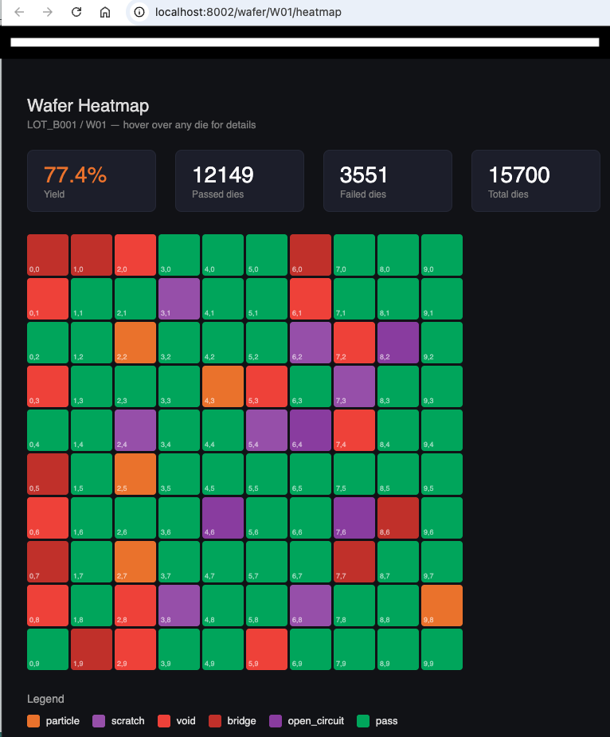
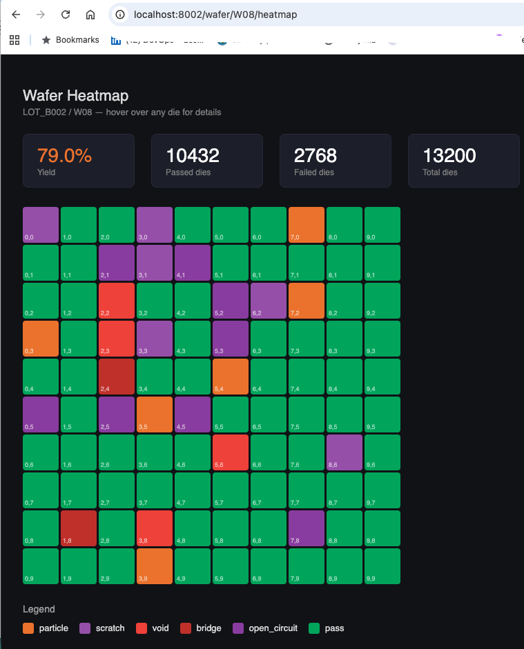
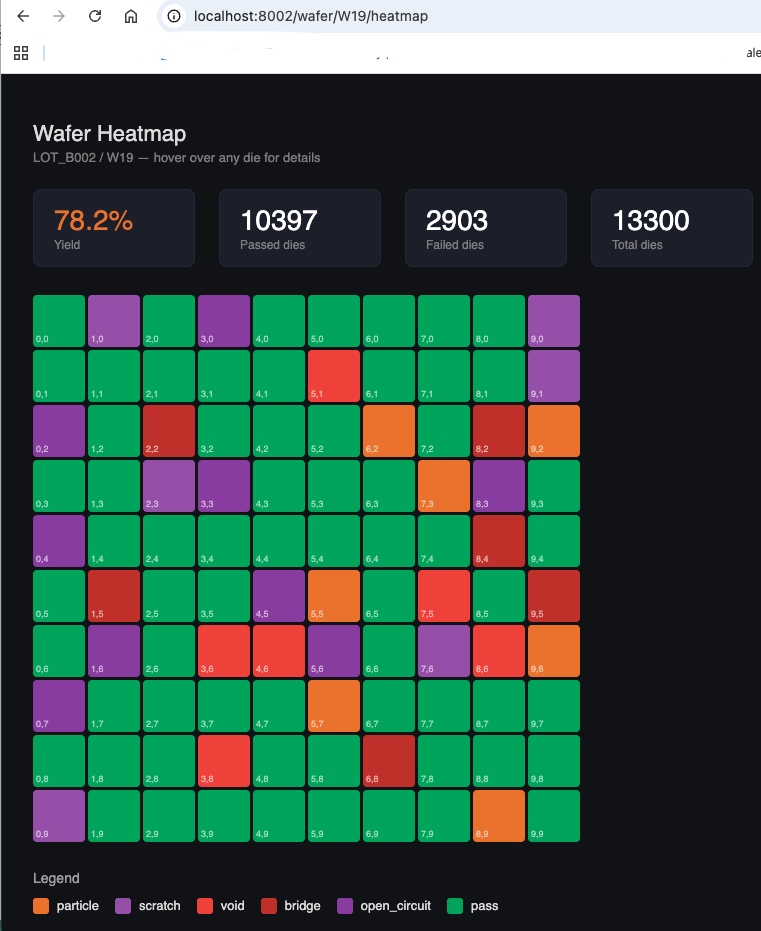

# Yield Data Platform

A production-grade manufacturing yield analysis pipeline for photonic circuit fabrication. Ingests wafer test results (die-level pass/fail data) through Apache Kafka, processes yield metrics with Spark Structured Streaming, stores versioned datasets in Delta Lake, and exposes a REST API with an interactive wafer heatmap visualization.

Built to demonstrate data platform engineering skills relevant to semiconductor and quantum computing environments — specifically yield analysis, failure analysis, and PPA tracking across the chip development lifecycle.

---

## Why this project exists

In photonic chip fabrication, yield is everything. A wafer comes out of the fab with 100 dies — some pass electrical and optical tests, some fail. Yield engineers need to answer: which lots are underperforming? Which defect types are most common? Which cell types fail most often on a given process node?

This platform answers all of those questions in real time, with every dataset version traceable back to the exact ingestion run and code commit that produced it.

---

## Architecture

```
Wafer test results (JSONL files)
         │
         ▼
┌─────────────────────┐
│   File Watcher      │  watchdog monitors ./wafer_outputs/
│   + Kafka Producer  │  enriches with run_id, git_sha, ingested_at
└──────────┬──────────┘
           │ Kafka topic: wafer-test-results (3 partitions)
           ▼
┌─────────────────────┐
│  Spark Structured   │  reads stream every 15 seconds
│  Streaming          │  calculates yield metrics per lot/wafer/cell
└──────────┬──────────┘
           │
      ┌────┴─────┐
      ▼          ▼
┌──────────┐  ┌──────────────────┐
│ Delta    │  │ Delta            │
│ Lake     │  │ Lake             │
│ (raw)    │  │ (yield summary)  │
└──────────┘  └──────────────────┘
           │
           ▼
┌─────────────────────┐
│  SQLite             │
│  Metadata Store     │  run_id → delta_version → git_sha
└──────────┬──────────┘
           │
           ▼
┌─────────────────────┐
│  FastAPI            │
│  Yield API  :8001   │  yield summaries, defect analysis,
│                     │  wafer heatmap, lineage queries
└─────────────────────┘
```

---

## Tech stack

| Layer | Tool | Purpose |
|---|---|---|
| Ingestion | Apache Kafka 7.6 (KRaft) | Die-level message streaming |
| Processing | Apache Spark 3.5.1 | Yield metric aggregations |
| Storage | Delta Lake 3.1.0 | Versioned raw and summary tables |
| Lineage index | SQLite | Fast provenance lookup |
| API | FastAPI + Uvicorn | Yield query and heatmap endpoints |
| Orchestration | Docker Compose | Local infrastructure |
| Language | Python 3.11 | All pipeline code |

---

## Project structure

```
yield-data-platform/
├── docker-compose.yml             # Kafka, Spark, Kafka UI
├── .gitignore
├── producer/
│   ├── producer.py                # File watcher + Kafka producer
│   ├── generate_data.py           # Synthetic wafer test data generator
│   └── requirements.txt
├── consumer/
│   ├── consumer.py                # Spark Structured Streaming consumer
│   ├── metadata_store.py          # SQLite read/write functions
│   ├── requirements.txt
│   └── __init__.py
├── api/
│   └── api.py                     # FastAPI yield and lineage endpoints
└── tests/
    └── test_metadata_store.py
```

---

## Quickstart

### Prerequisites

- Docker Desktop
- Python 3.11
- Java 17 (`brew install openjdk@17`)

### 1. Clone and set up environment

```bash
git clone https://github.com/masoodqq/yield-data-platform.git
cd yield-data-platform

python3.11 -m venv venv
source venv/bin/activate

pip install -r producer/requirements.txt
pip install -r consumer/requirements.txt
pip install fastapi uvicorn pytest
```

### 2. Start infrastructure

```bash
docker compose up -d
```

Wait 20 seconds then verify all containers are running:

```bash
docker ps --format "table {{.Names}}\t{{.Status}}"
```

### 3. Create Kafka topic

```bash
docker exec sim-lineage-pipeline-kafka-1 \
  kafka-topics --create \
  --topic wafer-test-results \
  --bootstrap-server localhost:9092 \
  --partitions 3 \
  --replication-factor 1
```

### 4. Start the producer (Terminal 1)

```bash
source venv/bin/activate
unset SPARK_HOME && unset PYTHONPATH
python producer/producer.py
```

### 5. Start the data generator (Terminal 2)

```bash
source venv/bin/activate
python producer/generate_data.py
```

Each wafer file contains 100 die records with realistic yield variation between 60-95%.

### 6. Start the Spark consumer (Terminal 3)

```bash
source venv/bin/activate
unset SPARK_HOME && unset PYTHONPATH
python consumer/consumer.py
```

Every 15 seconds you will see yield summaries per lot, wafer, and cell type:

```
--- Batch 3 | 100 die records ---
+--------+--------+---------+----------+------------+
|lot_id  |wafer_id|yield_pct|total_dies|defect_count|
+--------+--------+---------+----------+------------+
|LOT_A001|W01     |89.0     |100       |11          |
|LOT_B002|W24     |72.0     |100       |28          |
+--------+--------+---------+----------+------------+
```

### 7. Start the yield API (Terminal 4)

```bash
source venv/bin/activate
unset SPARK_HOME && unset PYTHONPATH
uvicorn api.api:app --reload --port 8001
```

---

## API endpoints

Interactive docs at **http://localhost:8001/docs**

### `GET /yield/{lot_id}`

Returns yield summary for all wafers in a lot.

```bash
curl http://localhost:8001/yield/LOT_A001
```

```json
{
  "lot_id": "LOT_A001",
  "wafers": [
    {
      "wafer_id": "W01",
      "process_node": "180nm",
      "avg_yield_pct": 89.0,
      "total_dies": 100,
      "passed_dies": 89,
      "total_defects": 11
    }
  ]
}
```

### `GET /wafer/{wafer_id}/defects`

Returns defect type breakdown and failed die coordinates for a wafer.

```bash
curl http://localhost:8001/wafer/W01/defects
```

```json
{
  "wafer_id": "W01",
  "defect_summary": [
    {"defect_code": "particle", "count": 4},
    {"defect_code": "scratch",  "count": 3},
    {"defect_code": "void",     "count": 2}
  ],
  "failed_die_coordinates": [
    {"x": 2, "y": 5},
    {"x": 7, "y": 3}
  ]
}
```

### `GET /wafer/{wafer_id}/heatmap`

Returns an interactive HTML wafer map showing pass/fail status for every die,
color coded by defect type.

```
http://localhost:8001/wafer/W01/heatmap
```

Color coding:
- Green — passed
- Orange — particle defect
- Purple — scratch
- Red — void
- Dark red — bridge
- Dark purple — open circuit

### `GET /lineage/{run_id}`

Traces a data ingestion run to its Delta Lake version and git commit.

```bash
curl http://localhost:8001/lineage/run_001397b1
```

```json
{
  "run_id": "run_001397b1",
  "results": [
    {
      "run_id": "run_001397b1",
      "git_sha": "22c92fe",
      "delta_version": 0,
      "row_count": 100,
      "processed_at": "2026-04-27 10:39:00"
    }
  ]
}
```

### `GET /datasets/{delta_version}`

Returns all ingestion runs that contributed to a specific dataset version.

```bash
curl http://localhost:8001/datasets/0
```

---

## Simulated wafer data schema

Each die record mirrors the structure of real EDA test output:

```json
{
  "lot_id":       "LOT_A001",
  "wafer_id":     "W01",
  "process_node": "180nm",
  "die_x":        4,
  "die_y":        7,
  "cell_type":    "ring_modulator",
  "passed":       true,
  "defect_code":  null,
  "test_results": {
    "insertion_loss":   -1.24,
    "extinction_ratio":  2.87,
    "bandwidth":         0.94,
    "dark_current":     -0.33,
    "responsivity":      1.12
  },
  "tested_at":   "2026-04-27T10:39:00Z",
  "run_id":      "run_001397b1",
  "git_sha":     "22c92fe",
  "ingested_at": "2026-04-27T10:39:00.253Z"
}
```

Supported lots: `LOT_A001`, `LOT_A002`, `LOT_B001`, `LOT_B002`

Supported cell types: `ring_modulator`, `mzi_switch`, `grating_coupler`, `phase_shifter`

Supported defect codes: `particle`, `scratch`, `void`, `bridge`, `open_circuit`

Process nodes: `180nm`, `130nm`, `90nm`

---

## Delta Lake time travel

Query the yield dataset at any historical version:

```python
df = spark.read.format("delta") \
    .option("versionAsOf", 0) \
    .load("./delta/wafer_raw")
```

---

## Wafer Heatmap Visualization

The platform includes an interactive HTML wafer map accessible directly in the browser. Each die in the 10x10 grid is color coded by pass/fail status and defect type. Hovering over any die shows the cell type, defect code, and coordinates.

**Color coding:**

| Color | Meaning |
|---|---|
| 🟢 Green | Passed |
| 🟠 Orange | Particle defect |
| 🟣 Purple | Scratch |
| 🔴 Red | Void |
| 🔵 Dark red | Bridge |
| ⚫ Dark purple | Open circuit |

Each heatmap also shows yield stats at the top:
- Overall yield percentage (green above 80%, orange above 60%, red below 60%)
- Total passed dies
- Total failed dies
- Total dies on wafer

To view heatmaps for different wafers replace the wafer ID in the URL:


 | http://localhost:8002/wafer/W01/heatmap
 |http://localhost:8002/wafer/W08/heatmap
 | http://localhost:8002/wafer/W19/heatmap


## Monitoring

| Service | URL |
|---|---|
| Kafka UI | http://localhost:8090 |
| Spark Master UI | http://localhost:8080 |
| Yield API docs | http://localhost:8001/docs |

---

## What I learned

- Designing Kafka topics for high-throughput die-level manufacturing data
- Using Spark Structured Streaming foreachBatch for custom aggregation logic
- Calculating yield metrics (pass rate, defect distribution, PPA) in real time
- Storing raw and summary datasets as separate versioned Delta Lake tables
- Building a FastAPI service with HTML response endpoints for visualization
- Generating wafer heatmaps from die coordinate data
- Capturing data provenance at ingest using git SHA and run IDs

---

## Relevance to semiconductor data platforms

This pipeline directly maps to photonic chip manufacturing data challenges:

- **Die-level test data** — simulates EDA and fab test output per die coordinate
- **Yield analysis** — real-time yield % per lot, wafer, cell type, process node
- **Defect tracking** — defect type distribution and spatial clustering via heatmap
- **PPA metrics** — insertion loss, bandwidth, responsivity tracked per cell
- **Data traceability** — every dataset version linked to run ID and git SHA
- **Versioned storage** — Delta Lake time travel enables point-in-time yield comparison
- **On-prem + cloud ready** — Kafka and Delta Lake deploy to both environments
